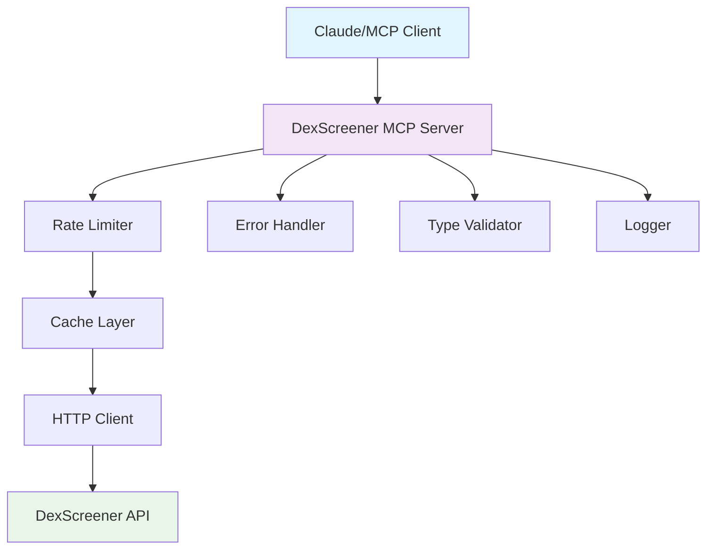

<div align="center">

# DexScreener MCP Server

[](https://www.python.org/downloads/)
[](https://opensource.org/licenses/MIT)
[](https://github.com/psf/black)
[](https://github.com/astral-sh/ruff)
[](https://mypy-lang.org/)

**Production-ready Model Context Protocol server for DexScreener API**

[Quick Start](#quick-start) • [Documentation](#available-tools) • [Development](#development) • [Features](#features)

</div>

---

## Why This MCP Server?

**Built for Production**: Enterprise-grade error handling, rate limiting, and monitoring  
**Lightning Fast**: Intelligent caching, async architecture, and optimized API calls  
**Rock Solid**: Comprehensive testing, type safety, and bulletproof error handling  
**Developer Friendly**: Beautiful APIs, extensive docs, and smooth developer experience  

---

## Features

### Complete DexScreener API Integration
- Token information and trading pairs
- Pair details and analytics  
- Search functionality
- Trending pairs discovery
- Multi-pair batch requests

### Production-Ready Architecture
- Comprehensive error handling
- Rate limiting (300 req/min by default)
- Intelligent caching with TTL
- Automatic retries with exponential backoff
- Input validation with Pydantic

### Monitoring & Observability
- Structured logging with `structlog`
- Request/response tracking
- Performance metrics
- Error analytics

### Developer Experience
- Full type safety with comprehensive annotations
- Beautiful async/await API
- Extensive documentation
- Easy configuration
- Development-friendly setup

## Quick Start

### Installation

```bash
# Clone the repository
git clone https://github.com/Malomalsky/dexscreener-mcp-server.git
cd dexscreener-mcp-server

# Standard installation
pip install -e .

# For development
pip install -e ".[dev]"

# If you have FastAPI compatibility issues
pip install -e ".[fastapi-compat]"
```

### Dependency Conflicts

If you encounter dependency conflicts with FastAPI or other packages:

```bash
# Option 1: Use virtual environment (recommended)
python -m venv venv
source venv/bin/activate  # On Windows: venv\Scripts\activate
pip install -e .

# Option 2: Force installation (may cause issues)
pip install -e . --force-reinstall

# Option 3: Use compatibility mode
pip install -e ".[fastapi-compat]"

# Option 4: Standalone minimal installation
python standalone_install.py
```

### Configuration

```bash
# Copy example environment file
cp .env.example .env

# Edit configuration (optional - works great with defaults!)
nano .env
```

### Running the Server

⚠️ **Important**: This is an MCP (Model Context Protocol) server designed to run within MCP-enabled applications. It cannot be used standalone.

```bash
# Test the server installation
python -c "from dexscreener_mcp.server import DexScreenerMCPServer; print('✅ Server ready!')"

# The server will be automatically started by MCP clients
# Do NOT run these commands directly unless testing:
# python -m dexscreener_mcp.server  # Will wait for MCP protocol input
```

**How it works**: MCP applications (Claude Desktop, Cursor, etc.) will automatically start and communicate with this server using the stdio protocol.

### Integration with Applications

<details>
<summary><strong>Claude Desktop</strong></summary>

Add to your `claude_desktop_config.json`:

```json
{
  "mcpServers": {
    "dexscreener": {
      "command": "python",
      "args": ["-m", "dexscreener_mcp.server"],
      "env": {}
    }
  }
}
```

**Config file locations:**
- **macOS**: `~/Library/Application Support/Claude/claude_desktop_config.json`
- **Windows**: `%APPDATA%/Claude/claude_desktop_config.json`

</details>

<details>
<summary><strong>Cursor IDE</strong></summary>

1. Install the MCP extension in Cursor
2. Add server configuration in Cursor settings:

**Option 1 (Recommended):**
```json
{
  "mcp.servers": {
    "dexscreener": {
      "command": "python",
      "args": ["-m", "dexscreener_mcp.server"],
      "env": {}
    }
  }
}
```

**Option 2 (Full path):**
```json
{
  "mcp.servers": {
    "dexscreener": {
      "command": "C:\\Users\\YourUser\\AppData\\Local\\Programs\\Python\\Python311\\python.exe",
      "args": ["-m", "dexscreener_mcp.server"],
      "env": {}
    }
  }
}
```

**Option 3 (Direct script):**
```json
{
  "mcp.servers": {
    "dexscreener": {
      "command": "dexscreener-mcp",
      "env": {}
    }
  }
}
```

3. **Troubleshooting:**
   - Check Cursor's output panel for MCP server logs
   - Verify Python is in PATH: `python --version`
   - Test server manually: `python -m dexscreener_mcp.server`
   - Restart Cursor after configuration changes

4. The server will show "⏳ Waiting for MCP client connection..." when working correctly

</details>

<details>
<summary><strong>Zed Editor</strong></summary>

In your Zed `settings.json`:

```json
{
  "assistant": {
    "mcp_servers": {
      "dexscreener": {
        "command": "python",
        "args": ["-m", "dexscreener_mcp.server"]
      }
    }
  }
}
```

</details>

<details>
<summary><strong>Continue.dev</strong></summary>

Add to your Continue configuration:

```json
{
  "mcpServers": {
    "dexscreener": {
      "command": "python",
      "args": ["-m", "dexscreener_mcp.server"]
    }
  }
}
```

</details>

<details>
<summary><strong>VS Code</strong></summary>

1. Install MCP extension for VS Code
2. Add to workspace settings (`.vscode/settings.json`):

```json
{
  "mcp.servers": {
    "dexscreener": {
      "command": "python",
      "args": ["-m", "dexscreener_mcp.server"]
    }
  }
}
```

</details>

<details>
<summary><strong>GitHub Codespaces</strong></summary>

Works out of the box! Just install the package:

```bash
pip install -e .
```

Then use with any MCP-enabled extension in Codespaces.

</details>

<details>
<summary><strong>Custom MCP Client</strong></summary>

For custom implementations, use the MCP SDK:

```python
from mcp import ClientSession
import asyncio

async def main():
    async with ClientSession("dexscreener-mcp") as session:
        # List available tools
        tools = await session.list_tools()
        
        # Call a tool
        result = await session.call_tool(
            "search_tokens", 
            {"query": "USDC", "limit": 10}
        )
        print(result)

asyncio.run(main())
```

</details>

### Example Usage

```bash
# Through any MCP-enabled application:
"Get token information for USDC"
"Search for trending Ethereum pairs" 
"Find information about Uniswap V3 WETH/USDC pair"
"Show me the top 5 trending pairs on Base network"
"What's the current price and volume for PEPE token?"
```

## Available Tools

| Tool | Description | Example |
|------|-------------|---------|
| **`get_token_info`** | Get comprehensive token data and trading pairs | `{"token_address": "0xA0b86a33E6Fe17D51f8C62C7B4E8CC38F8D5A0D8"}` |
| **`get_pair_info`** | Detailed trading pair analytics with price, volume, liquidity | `{"chain_id": "ethereum", "pair_address": "0x88e6a0c2ddd26feeb64f039a2c41296fcb3f5640"}` |
| **`search_tokens`** | Smart token search by name, symbol, or address | `{"query": "PEPE", "limit": 20}` |
| **`get_trending_pairs`** | Discover hot and trending pairs on any blockchain | `{"chain_id": "base"}` |
| **`get_multiple_pairs`** | Batch requests for multiple pairs efficiently | `{"pair_addresses": ["ethereum:0x...", "bsc:0x..."]}` |
| **`get_supported_chains`** | List all supported blockchain networks | `{}` |
| **`get_rate_limit_info`** | Check current API rate limit status | `{}` |

### Response Examples

<details>
<summary><strong>Token Search Example</strong></summary>

```json
{
  "tool": "search_tokens",
  "query": "USDC",
  "response": {
    "pairs": [
      {
        "chainId": "ethereum",
        "dexId": "uniswap",
        "url": "https://dexscreener.com/ethereum/0x88e6a0c2ddd26feeb64f039a2c41296fcb3f5640",
        "pairAddress": "0x88e6a0c2ddd26feeb64f039a2c41296fcb3f5640",
        "baseToken": {
          "address": "0xc02aaa39b223fe8d0a0e5c4f27ead9083c756cc2",
          "name": "Wrapped Ether",
          "symbol": "WETH"
        },
        "quoteToken": {
          "address": "0xa0b86a33e6fe17d51f8c62c7b4e8cc38f8d5a0d8",
          "name": "USD Coin",
          "symbol": "USDC"
        },
        "priceUsd": "3456.78",
        "volume": {
          "h24": 145000000
        }
      }
    ]
  }
}
```

</details>

<details>
<summary><strong>Trending Pairs Example</strong></summary>

```json
{
  "tool": "get_trending_pairs",
  "chain_id": "base",
  "response": {
    "pairs": [
      {
        "chainId": "base",
        "dexId": "uniswap",
        "priceUsd": "0.000024",
        "priceChange": {
          "h24": 156.7
        },
        "volume": {
          "h24": 2400000
        },
        "marketCap": 12000000
      }
    ]
  }
}
```

</details>

## Architecture & Design

<div align="center">



</div>

### Project Structure

```
dexscreener_mcp/
├── __init__.py          # Package initialization & exports
├── server.py            # MCP server implementation
├── client.py            # DexScreener API client with all features
└── types.py             # Pydantic models & type definitions
```

### Key Components

| Component | Description | Features |
|-----------|-------------|----------|
| **`DexScreenerMCPServer`** | Main MCP server | Tool routing, Error handling, Logging |
| **`DexScreenerClient`** | API client | Rate limiting, Caching, Retries |
| **Pydantic Models** | Type safety | Validation, Serialization, Documentation |
| **Error System** | Exception handling | User-friendly errors, Monitoring, Debugging |

## Configuration Options

| Variable | Default | Description | Recommendation |
|----------|---------|-------------|----------------|
| `DEXSCREENER_RATE_LIMIT` | `300` | Requests per minute | Keep default for best performance |
| `DEXSCREENER_CACHE_TTL` | `60` | Cache TTL in seconds | Increase for less volatile data |
| `DEXSCREENER_TIMEOUT` | `30` | Request timeout in seconds | Good for most networks |
| `DEXSCREENER_MAX_RETRIES` | `3` | Maximum retry attempts | Increase for unstable connections |
| `LOG_LEVEL` | `INFO` | Logging verbosity | Use `DEBUG` for development |
| `LOG_FORMAT` | `json` | Log format | `json` for production, `text` for dev |

### Example Configuration

```bash
# .env file
DEXSCREENER_RATE_LIMIT=300      # Respectful rate limiting
DEXSCREENER_CACHE_TTL=60        # Fast responses with smart caching  
DEXSCREENER_TIMEOUT=30          # Reasonable timeout
DEXSCREENER_MAX_RETRIES=3       # Resilient error handling
LOG_LEVEL=INFO                  # Balanced logging
LOG_FORMAT=json                 # Structured logs for monitoring
```

## Development

### Setup Development Environment

```bash
# Install development dependencies
pip install -e ".[dev]"

# Install pre-commit hooks for automated quality checks
pre-commit install

# Run tests with coverage
pytest --cov=dexscreener_mcp --cov-report=html

# Run the full quality check suite
make lint    # or run manually below
```

### Manual Quality Checks

```bash
# Code formatting
black dexscreener_mcp/
isort dexscreener_mcp/

# Linting
ruff check dexscreener_mcp/ --fix

# Type checking  
mypy dexscreener_mcp/

# Testing
pytest tests/ -v
```

### Code Quality Standards

This project follows enterprise-grade standards:

| Tool | Purpose | Config |
|------|---------|--------|
| **Black** | Code formatting | `line-length = 88` |
| **isort** | Import sorting | `profile = "black"` |
| **Ruff** | Fast linting | `target-version = "py39"` |
| **mypy** | Type checking | `strict = true` |
| **pytest** | Testing framework | `asyncio_mode = "auto"` |
| **pre-commit** | Quality gates | Automated on commit |

## API Reference & Supported Networks

### Supported Blockchains

| Network | Chain ID | Native Token | Explorer |
|---------|----------|--------------|----------|
| **Ethereum** | `ethereum` | ETH | [etherscan.io](https://etherscan.io) |
| **BNB Smart Chain** | `bsc` | BNB | [bscscan.com](https://bscscan.com) |
| **Polygon** | `polygon` | MATIC | [polygonscan.com](https://polygonscan.com) |
| **Arbitrum** | `arbitrum` | ETH | [arbiscan.io](https://arbiscan.io) |
| **Optimism** | `optimism` | ETH | [optimistic.etherscan.io](https://optimistic.etherscan.io) |
| **Base** | `base` | ETH | [basescan.org](https://basescan.org) |
| **Avalanche** | `avalanche` | AVAX | [snowtrace.io](https://snowtrace.io) |
| **Fantom** | `fantom` | FTM | [ftmscan.com](https://ftmscan.com) |

*And 20+ more networks supported!*

### Response Models

All API responses are validated using **Pydantic v2** models:

```python
# Token Information
class TokenResponse:
    pairs: List[PairInfo]  # All trading pairs for token

# Trading Pair Details  
class PairResponse:
    pair: Optional[PairInfo]  # Detailed pair information

# Search Results
class SearchResult:
    pairs: List[PairInfo]  # Matching pairs from search

# Trending Data
class TrendingResponse:
    pairs: List[PairInfo]  # Hot/trending pairs
```

## Error Handling

| Error Type | Handling Strategy | User Experience |
|------------|-------------------|-----------------|
| **API Errors** | Structured error parsing | Clear, actionable error messages |
| **Network Issues** | Exponential backoff retry | Automatic recovery, no interruption |
| **Rate Limits** | Intelligent throttling | Smooth operation within limits |
| **Validation** | Pydantic model validation | Type-safe, validated responses |
| **Timeouts** | Configurable timeouts | Predictable response times |

## Performance & Optimization

### Speed Features

- **Smart Caching**: TTL-based response caching
- **Rate Limiting**: Respectful 300 req/min default  
- **Connection Pooling**: Efficient HTTP client reuse
- **Async Architecture**: Non-blocking I/O operations
- **Batch Processing**: Multi-pair requests in single call

### Performance Metrics

```bash
# Typical response times (with cache miss)
Token Info:        ~200ms
Pair Details:      ~150ms  
Search Results:    ~300ms
Trending Pairs:    ~250ms

# With cache hit: ~5-10ms
# Rate limit overhead: ~0ms (smart queuing)
```

## Contributing

We welcome contributions! Here's how to get started:

### Quick Contribution Guide

1. **Fork** the repository
2. **Create** a feature branch (`git checkout -b feature/amazing-feature`)
3. **Make** your changes with tests
4. **Run** quality checks (`pre-commit run --all-files`)
5. **Commit** with descriptive messages
6. **Push** to your branch
7. **Open** a Pull Request

### Contribution Checklist

- [ ] Code follows project style (Black, isort, Ruff)
- [ ] Tests added for new functionality  
- [ ] Documentation updated if needed
- [ ] Type hints added for new code
- [ ] Performance impact considered
- [ ] Security implications reviewed

## Useful Links

- **[Report Bugs](https://github.com/Malomalsky/dexscreener-mcp-server/issues)**
- **[Request Features](https://github.com/Malomalsky/dexscreener-mcp-server/discussions)**  
- **[MCP Documentation](https://modelcontextprotocol.io/docs)**
- **[DexScreener API](https://docs.dexscreener.com/)**

---

<div align="center">

## License

This project is licensed under the **MIT License** - see the [LICENSE](LICENSE) file for details.

## Acknowledgments

**Special thanks to:**
- **[DexScreener](https://dexscreener.com/)** for the excellent DeFi data API
- **[Model Context Protocol](https://github.com/modelcontextprotocol)** for the amazing MCP framework  
- **Python Community** for incredible libraries and tools
- **Anthropic** for Claude and MCP innovation

---

**Built with enterprise standards • Production ready • Type safe • Resilient • Monitored**

*Star this repo if it helped you build amazing DeFi tools!*

</div>